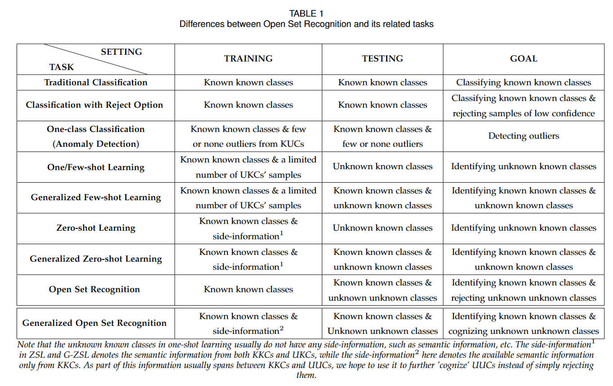

- Open Set Recognition「开集学习」 #深度学习 #开集学习
	- 参考资料
		- [【领域速览】Open Set Recognition领域基本介绍](https://zhuanlan.zhihu.com/p/458672374)
		- [开放集学习 Open Set Learning](https://zhuanlan.zhihu.com/p/631899702)
	- Open Set Learning 「开集学习」
		- Open Set & Close Set
			- 先前的学习是闭集学习——数据集包含了问题所有可能的样本。人话说，闭集面对的问题是你已经知道考试的考试范围，你可以根据考试范围去进行备考。
			- 开集学习则是问题的解比数据集大——存在未知的测试数据。同样人话，你不知道考试的考试范围，你不懂考试会考什么，就算你按着某一个范围去备考，考试也有可能考到范围外的内容。
	- Basic Recognition Categories of Classes 四种类型人话介绍
		- KKCs：知道长什么样，知道属于哪类
		- KUCs：知道长什么样，不知道属于哪类
		- UKCs：不知道长什么样，知道属于哪类
		- UUCs：不知道长什么样，也不知道属于哪类
	- OSR 的不同任务
		- 
		-
- Define And Run & Define By Run #pigeonet
	- Define And Run
		- 「静态计算图」先定义计算图，然后再流转数据
		  :LOGBOOK:
		  CLOCK: [2024-11-10 Sun 19:30:03]
		  :END:
		  类似于老版本的pigeonet，数据流的计算在真正计算开始前就已经被动地由计算图固定了。
		- 静态计算图优点是「性能」。静态计算图因为计算图已经存在，因此可以通过优化计算图来提高性能。同时由于计算图已经编译好了，因此不需要在运行时构建计算图。
	- Define By Run
		- 「动态计算图」计算图是由数据流定义的
		  也就是说先有数据（variable）进行计算，然后再根据计算构建计算图。这也是pigeonet采用的方式。
		- pigeonet底层是链表构成的图，图中的节点有「函数」和「变量」节点。对应了Function类和Variable类。正向传播时Function.inputs引用上游Variable，同时下游Variable.creator记录了上游的Function，因此可以进行正向传播的计算和反向传播的计算。
		- 动态计算图的优点是「易学」和「方便调试」。动态计算图不需要静态编译，计算图由计算构建，因此可以轻松直观地进行计算和调试工作。